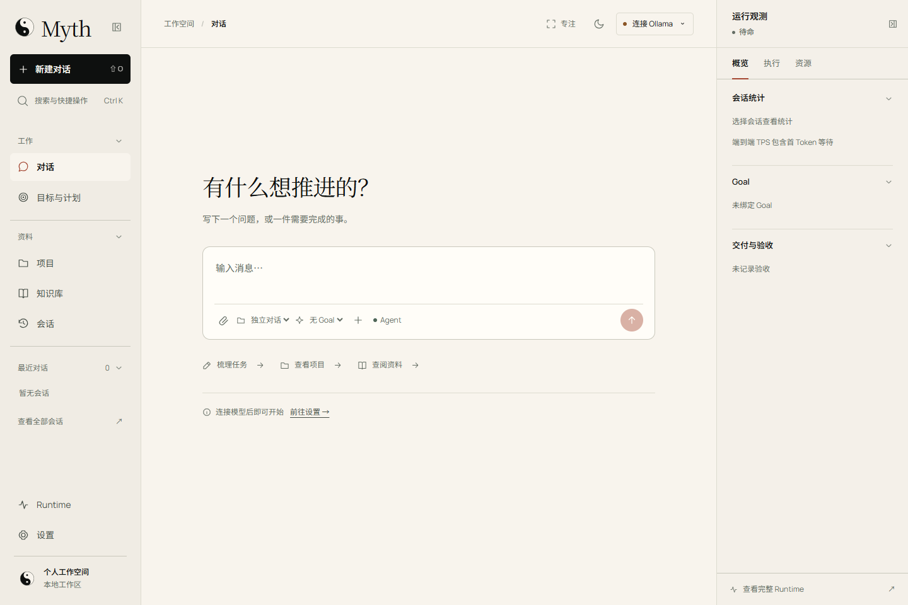
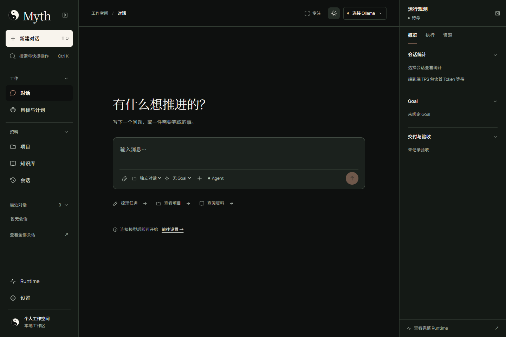
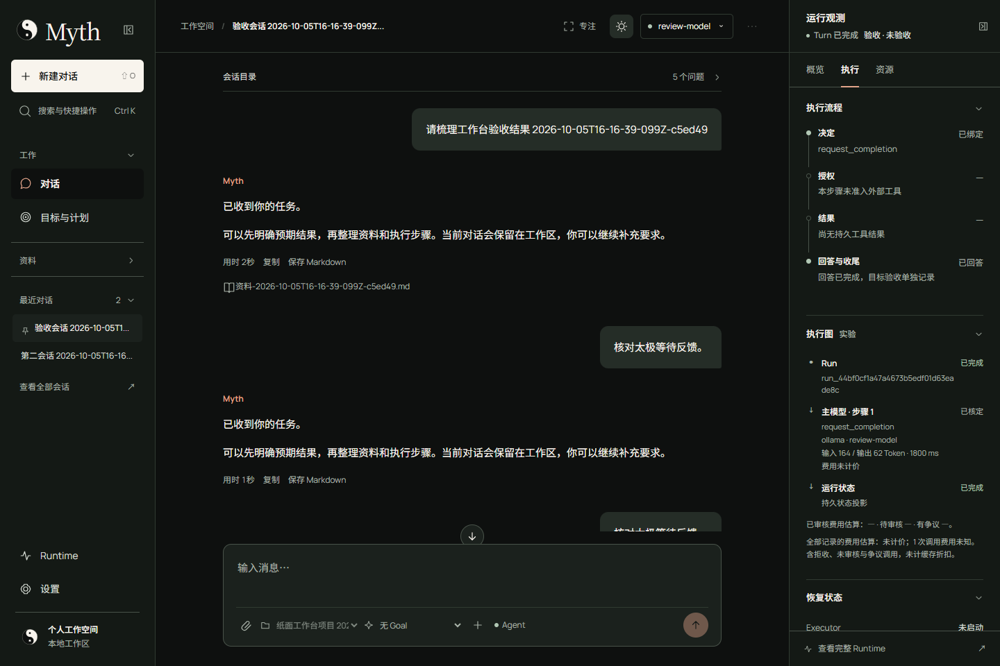
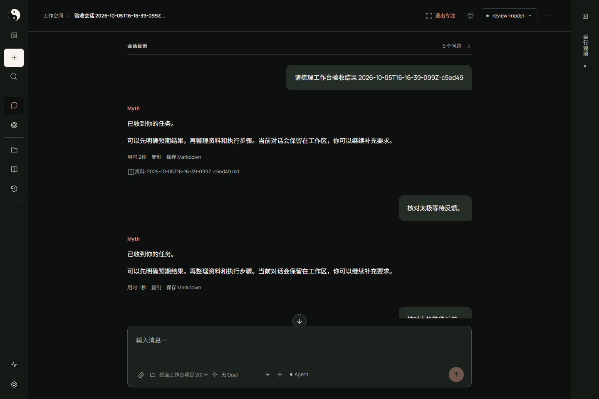
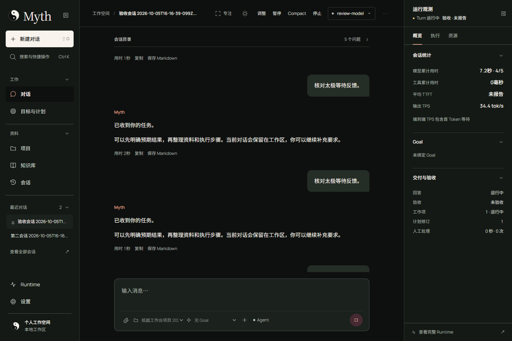

# Myth · 可展开的工作台

用户确认「艺术机构：安静、精确、有辨识度」。2026-10-06 修订固定白色 `#F8F4ED`、黑色 `#0E100F`，移除纸构装饰并使用太极标志，保留本地中文字体和三栏交互。视觉合同见 [DESIGN.md](../DESIGN.md)，页面决策见 [workbench.md](../.impeccable/surfaces/workbench.md)。

## 可以实际操作什么

- 左栏：工作、资料、最近会话分别折叠；收成窄轨道后主入口仍可用，展开时恢复分组偏好。
- 中央：已有会话出现问题目录，按持久消息身份返回原问题；专注模式同时收起两栏，退出时恢复进入前的左右布局和草稿。`Escape` 先归当前弹窗，再用于退出专注。
- 右栏：概览、执行、资源三个观察角度；统计、Goal、交付、执行链、执行图、恢复、轨迹、工具、控制、模型、Tokens、上下文、预算、路径比较、架构状态均保留。每类证据独立折叠，运行与独立验收提示持续可见。
- 中央消息与输入框两侧共享阅读尺度，手机与专注模式保持对齐；新 Run 的中央和右栏同步读取同一投影。
- 子模型默认沿用主模型提供方；上下文窗口及本地服务地址仅在 Ollama 时显示，切换提供方保留原值，凭据依旧走原安全入口。
- 动效：空间分配 260ms、角度切换 180ms，真实等待使用 14px 太极，2.6 秒匀速转一周；减少动态效果偏好使其静止，手机保留抽屉焦点边界。

`studio.js` 只拥有浏览器布局偏好。业务状态仍由既有 Runtime/仓储持有；切换页面、目录或折叠不授予权限、不创建 Run、不补造进度。已知文字可中文化，未知后端值原样保留。

## 字体与图像

正文采用本地 Noto Sans SC，拉丁文字采用 Manrope，静态标题采用 Noto Serif SC；许可与来源在 [fonts/README.md](../src/myth/webui/fonts/README.md)。完整正文字符表避免中文长尾字形依赖在线服务。`scripts/build_ui_fonts.py` 记录字体子集构建过程。

太极采用 [taiji.svg](../src/myth/webui/taiji.svg)，双鱼等面积、相反阴阳眼，整体旋转 180°；主标志 32px、工作区 24px、等待 14px。图形按几何路径原生绘制，favicon 共用形状。纸构图案按用户要求退出页面、HTTP 和发布包，仅在垃圾站留档。没有远程字体、图库或动效依赖，未新增前端框架。

## 实际画面

以下为本轮 Chrome 截图；执行、专注和等待采用固定 Provider 的验收会话，属于测试数据。

## 验证记录

2026-10-06，基于 `main ef351182` / v0.27.0；使用新的独立 Runtime 根目录，保留旧实验库。

| 范围 | 结果 |
| --- | --- |
| Python 全量回归 | 480 项运行：479 项通过，1 项跳过 |
| Node 观测、重连、统计与交互 | 36 项通过 |
| Chrome 真实 HTTP/SQLite/Runtime 操作链 | 21 条通过；console/page/HTTP/request 异常均为 0 |
| 双主题路由与尺寸矩阵 | 78 项普通布局检查，加 1 项修正后的 200% 等效重排 |
| 手机重点操作 | 14 项通过；核心触控目标至少 44px |
| 三栏视图行为 | 8 项通过，含焦点/草稿/布局恢复与无业务副作用 |
| 用户修订 | 14 次精确边线测量、4 项色板/资产删除/提供方/真实等待检查通过 |
| 字体和请求 | 本地字体加载完成，无外部资源请求 |
| 安装 wheel | 实际导入、HTTP 资产、Goal/Session、计划保存/暂停通过；18 份静态字节与最终源码一致 |
| 发布边界 | wheel 无垃圾站、Runtime 数据、截图输出或淘汰模块 |
| 编译、中文说明、敏感模式扫描 | 通过 |

缩放采集曾误用 `body.zoom=2`，该样本已作废。当前使用 720×480 CSS 视口与 2 倍设备比例生成 1440×960 原生截图，响应断点、单栏、无溢出均断言通过；这是 **200% 等效 CSS 重排**，没有声称验证了 Chrome 菜单操作。

独立设计评审读取最终源码与 27 张桌面/手机/双主题/缩放截图；唯一浅色次要文字对比度问题已修正并定向复核，最终 disposition 为 `ship`，记录见本地 `output/playwright/taiji-design-review.md`。固定 Provider 不证明真实模型质量、OAuth 或远端账号联调；没有实体手机键盘和完整屏幕阅读器验收。测试报告位于本地 `output/playwright/`。
